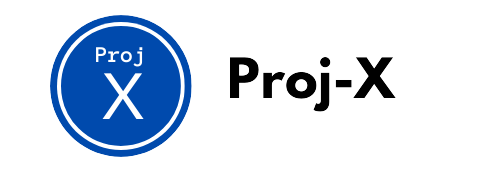

<p align="center">
  <h1 align="center">ProjX</h1>

  </img>
  
  <p align="center">
    Building relationships between students and companies through project-based work. Kickstart your career through projects.
    <br> 
    Developed by Boston students for Boston students.
    <br>
    <a href="https://projx-hbp.web.app" target="_blank">Check out the live demo app!</a>  </p>
</p>

## About

ProjX is a platform for students to build their portfolios through project-based work. Inspired by Fiverr and LinkedIn, companies may contract projects to be completed by prospective students, while students may explore and apply to projects they are interested in. This project was developed by Randy Huang, Tarun Eswar, Erica Dong, and Charles Tang for the HackBeanPot 2024 36 hour hackathon.

## Our Process 

We were motivated by the great difficulty in finding projects to work on to “build” your portfolio, especially in SWE and the arts. So, we determined a need for a streamlined system of finding, obtaining roles, and keeping track of projects. As a result, ProjX came to be. We spent the first night planning our idea, including developing our unique “connection” system between companies and students. We also sketched our idea on a whiteboard while researching similar designs: Canvas, LinkedIn, Fiverr, Crossover, etc.

This was the first time most of our team members had developed with ReactJS and Firebase, so learning how these web technologies work was a significant challenge, especially with passing data between components. It was very difficult to connect the web application to FirebaseAuth since this was our first time integrating a full-user system into a web application. Our team learned a lot about teamwork and communication in SWE, especially using GitHub as a centralized platform for code management. Furthermore, we learned a lot about the ideation process and how to plan for software with many moving parts (components, personal + company data, cloud hosting, etc). Lastly, we dealt with an extensive data generation process to mimic full usage on the app, and to demonstrate its full potential with companies and students using the platform.

## Current Features

- Project listings dashboard for students to explore and apply to
- Personal profile for each student, project, and company, with personalized company comments on every project
- Student and company side logins to view project listings and application statuses

### Future Work

- Migrate to a permanent API location and custom domain
- Partner with real-world companies to begin offering project opportunities for Boston students
- AI-based (collaborative recommender) project recommendations based on your major, interests, and feedback from previous projects 
- Full integration with LinkedIn API for full-time offers and automatic resume syncing and credentials for successfully completing each project
- GitHub sync for keeping up-to-date with personal projects

## Contributing

We'd love to have your help in making ProjX better. The project still has work to do before the full production launch, but if there's an issue you'd like to see addressed sooner rather than later, feel free to report it in the issues!

<hr>

## Technical

ProjX was developed with the FERN stack during the 2024 HackBeanPot hackathon. The front end is hosted on Firebase, and our back end is hosted on Heroku. Our authentication servies are provided by FirebaseAuth.

### Technologies Used
<div align="center">
<p align="center"> 
  <a href="https://expressjs.com" target="_blank" rel="noreferrer"> 
     
  </a>
    <a href="https://www.w3schools.com/css/" target="_blank" rel="noreferrer">  </a>  <a href="https://firebase.google.com/" target="_blank" rel="noreferrer">  </a> <a href="https://www.w3.org/html/" target="_blank" rel="noreferrer">  </a>  <a href="https://developer.mozilla.org/en-US/docs/Web/JavaScript" target="_blank" rel="noreferrer">  </a> <a href="https://nodejs.org" target="_blank" rel="noreferrer">  </a> <a href="https://reactjs.org/" target="_blank" rel="noreferrer">  </a> </p>
</div>

### Local Hosting

To run the project locally, you may clone the web-app and server repository. You must have Node version 18+ installed on your machine.

**Web App**
```bash
git clone https://github.com/ProjX/web-app.git
```

Then, install the dependencies.

```bash
cd web-app
npm install
```

Finally, run the project.

```bash
npm start
```

Go to `localhost:3000` to view the project.

**Server**
```bash
git clone https://github.com/ProjX/server.git
```

Then, install the dependencies.

```bash
cd server
npm install
```

Finally, run the project.

```bash
node index
```

The server will be listening on port 1000, or the port of your choice.

### Versions
* Version 1.0 (02/25/2024)
    * Initial Release
    * See [Commits history]

### License

GPL-3.0
